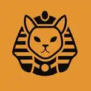

<div align="center">
  
  
  # 🐾 PetRescue - Plataforma de Adopción y Rescate

  **Conectando corazones peludos con hogares llenos de amor.**
  
  [](https://react.dev/)
  [](https://www.typescriptlang.org/)
  [](https://vitejs.dev/)
  [](https://mui.com/)
  [](https://vercel.com/)
  [](https://playwright.dev/)
</div>

---

## 📖 Sobre el Proyecto

**PetRescue** (Proyecto Cairo) es una plataforma integral diseñada con un **fuerte propósito social**: facilitar la adopción de mascotas rescatadas, organizar eventos comunitarios (vacunación, esterilización, jornadas de adopción) y centralizar la gestión de albergues y refugios de animales.

La plataforma cuenta con una interfaz moderna y un panel de administración seguro para gestionar todo el ciclo de vida de los rescates. 

### ✨ Funcionalidades Clave

- 🐶 **Catálogo de Adopción:** Visualización de mascotas disponibles con filtros y perfiles detallados.
- 📅 **Cartelera de Eventos y Anuncios:** Difusión de jornadas de adopción, vacunación y alertas generales.
- 🛠️ **Panel de Administración (Admin Dashboard):** Gestión completa (CRUD) de mascotas, eventos y configuración.
- 🔐 **Autenticación Segura:** Acceso protegido por JWT para administradores.
- 📭 **Estados Vacíos Optimizados:** Mensajes amigables y llamadas a la acción cuando no hay registros activos.
- 📱 **SEO y PWA Ready:** Configuración preparada para indexación dinámica (`react-helmet-async`) y rendimiento en dispositivos móviles.

---

## 🛠️ Stack Tecnológico

El proyecto utiliza tecnologías modernas para garantizar rendimiento, escalabilidad y una experiencia de usuario (UX) de primer nivel:

### Frontend
- **Framework:** [React 18](https://react.dev/)
- **Lenguaje:** [TypeScript](https://www.typescriptlang.org/)
- **Bundler:** [Vite](https://vitejs.dev/)
- **UI & Componentes:** [Material UI (MUI) v6](https://mui.com/) + `@emotion/react`
- **Enrutamiento:** [React Router DOM v7](https://reactrouter.com/)
- **Formularios & Validación:** [Formik](https://formik.org/) + [Yup](https://github.com/jquense/yup)
- **Manejo de Estado Remoto:** [TanStack Query v5](https://tanstack.com/query)
- **Fechas y Calendarios:** `@mui/x-date-pickers` + `dayjs`

### Testing / QA Automation
- **E2E Testing:** [Playwright](https://playwright.dev/) para auditoría de accesibilidad, enlaces, SEO y simulación de flujos de usuario completos.

### Backend (Serverless)
- **Entorno:** [Vercel Serverless Functions](https://vercel.com/docs/functions) (`/api`)
- **Almacenamiento (Storage):** Arquitectura Headless CMS usando la **API de GitHub**.
- **Cache & Rate Limiting:** [Upstash Redis](https://upstash.com/) + `@upstash/ratelimit`
- **Seguridad:** `bcryptjs` (Hashing), `jsonwebtoken` (Auth).

---

## 📂 Arquitectura y Estructura de Directorios

Nuestra arquitectura está **desacoplada**: el código fuente vive en este repositorio, mientras que los datos e imágenes se almacenan en un repositorio separado actuando como CMS.

```text
📦 petrescue-main
 ┣ 📂 api/                   # Backend: Vercel Serverless Functions
 ┃ ┣ 📂 _lib/                # Utilidades del backend (Github API, Redis KV)
 ┃ ┣ 📂 auth/                # Endpoints de autenticación (Login, Init)
 ┃ ┣ 📂 pets.ts              # Endpoints CRUD de mascotas
 ┃ ┣ 📂 announcements.ts     # Endpoints CRUD de eventos y anuncios
 ┃ ┗ 📂 users/               # Gestión de administradores
 ┣ 📂 public/                # Archivos estáticos y SEO (robots.txt, sitemap)
 ┣ 📂 src/                   # Frontend: Aplicación React
 ┃ ┣ 📂 api/                 # Cliente HTTP y configuración de llamadas (Axios)
 ┃ ┣ 📂 assets/              # Imágenes y SVGs locales de la app
 ┃ ┣ 📂 components/          # Componentes UI reutilizables (Navbar, Cards, Forms)
 ┃ ┣ 📂 contexts/            # Contextos de React (AuthContext)
 ┃ ┣ 📂 pages/               # Vistas de enrutamiento (Home, Admin, Catalog, etc.)
 ┃ ┣ 📂 theme/               # Configuración de Material UI (Colores, Tipografía)
 ┃ ┣ 📂 types/               # Definiciones e Interfaces globales de TypeScript
 ┃ ┗ 📂 utils/               # Utilidades (Optimizador de imágenes webp, WhatsApp)
 ┣ 📜 package.json           # Dependencias y scripts
 ┣ 📜 vite.config.ts         # Configuración del bundler
 ┗ 📜 .env.example           # Plantilla de variables de entorno
```

---

## 🚀 Guía de Instalación y Uso

### 1. Prerrequisitos
- Node.js (v18+)
- Gestor de paquetes: `npm` o `pnpm`
- CLI de Vercel (Recomendado para simular entorno Serverless local) -> `npm i -g vercel`

### 2. Instalación

Clona el repositorio e instala las dependencias:

```bash
git clone https://github.com/tu-usuario/petrescue-main.git
cd petrescue-main
npm install
```

### 3. Variables de Entorno (.env)

Copia el archivo de ejemplo y completa tus variables:

```bash
cp .env.example .env
```

Configura las siguientes variables críticas en tu archivo `.env`:

```env
# GitHub Configuration (Para usar el Repositorio de Storage como DB)
GITHUB_TOKEN="tu_token_personal_de_github"
GITHUB_OWNER="usuario_u_organizacion"
GITHUB_REPO="nombre_repo_storage"
GITHUB_BRANCH="main"

# Upstash Redis Configuration (Para Rate Limiting y Cache)
UPSTASH_REDIS_REST_URL="https://tu-endpoint-upstash.upstash.io"
UPSTASH_REDIS_REST_TOKEN="tu_token_upstash"

# Auth Configuration
ADMIN_PASSWORD_HASH="hash_generado_con_bcrypt"
JWT_SECRET="super_secreto_largo_y_seguro"

# VITE URL (SEO y Metadatos)
VITE_SITE_URL="http://localhost:5173"
```

### 4. Entorno de Desarrollo

Para ejecutar el frontend y el backend (serverless) localmente, utiliza Vercel CLI:

```bash
vercel dev
```
> Esto iniciará tanto el servidor de desarrollo de Vite (Frontend) como el entorno serverless (Backend) en un solo puerto (generalmente `localhost:3000`).

Si solo deseas trabajar en UI usando mock data:
```bash
npm run dev
```

### 5. Pruebas Automatizadas (E2E Testing)

El proyecto cuenta con una robusta suite de pruebas integrales para garantizar calidad, accesibilidad y evitar regresiones:

- `npm run test:e2e` (ejecución general)
- `npm run test:e2e:ui` (interfaz visual interactiva)
- `npm run test:report` (ver reporte de resultados)

---

## ⚙️ Flujo de Contribución y Buenas Prácticas

Si deseas contribuir a **PetRescue**, sigue estas buenas prácticas:

1. **Imágenes Optimizadas:** Todo flujo de subida de imágenes desde el admin pasa por un proceso de compresión a `WebP` en el cliente (`src/utils/imageOptimizer.ts`) antes de subir a GitHub. **No cambies este flujo** para evitar saturar el repositorio Storage.
2. **Componentes Puros:** Mantén la lógica de API aislada mediante `TanStack Query`.
3. **Commit Convention:** Usa _Conventional Commits_ (feat, fix, docs, chore).
4. **MUI System:** Evita CSS puro; usa el sistema `sx` de Material UI o `styled()` para mantener cohesión con el archivo `theme.ts`.

<br/>
<div align="center">
  <i>Construido con ❤️ para darles una segunda oportunidad.</i>
</div>
